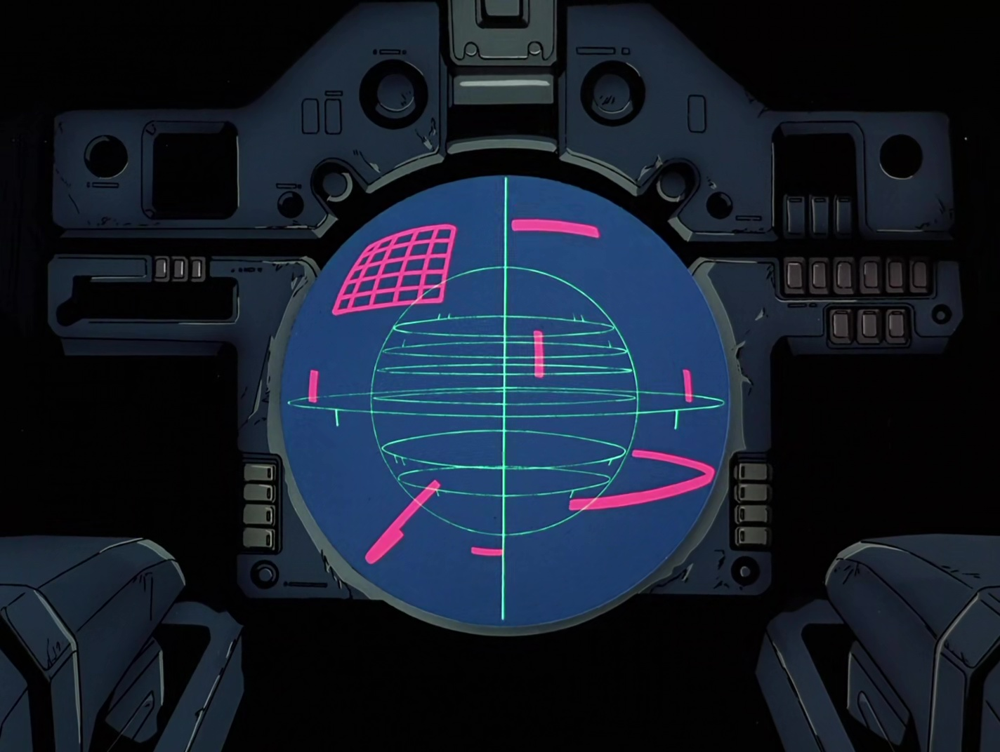

# ZERO System
The ZERO System analyzes a given situation based on the massive amounts of data collected by its various sensors, then transmits multiple possible responses, as well as the results, directly into the pilot's brain. In other words, it shows the pilots the actions necessary in order to achieve victory.

In reality, this ZERO System is a machine learning (ML) framework that I have built in order to understand ML better and to try out different ideas that I have. This is not meant to be used in any production setting -- or any setting really. It is just my fun little project. If you can guess what the above description & picture is in refence to, then kudos!